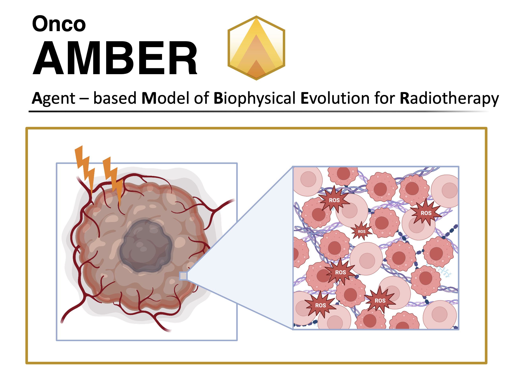

AMBER documentation
====================

**AMBER** (Agent-based fraMework for radioBiological Effects in Radiotherapy)

.. toctree::
    :maxdepth: 2
    :caption: Contents

    overview
    installation
    quickstart
    configuration
    pipeline
    tutorials/index
    api/index
    citation

Indices and tables
------------------
* :ref:`genindex`
* :ref:`modindex`
* :ref:`search`